[](https://github.com/sponsors/aozyildirim)
[](LICENSE)
[](https://agena.dev)

# AGENA — Agentic AI Platform | Pixel Agent Powered Autonomous Code Generation

<p align="center">
  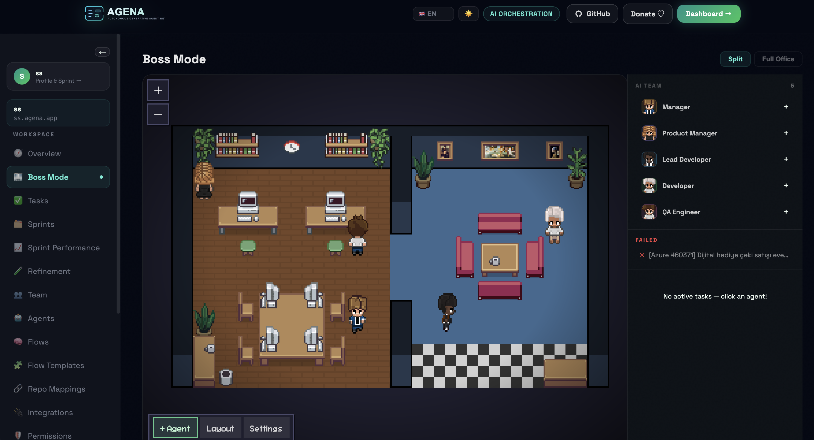
</p>

> **The open-source agentic AI platform that writes code, reviews quality, and ships pull requests autonomously.**

AGENA is a production-ready, multi-tenant **agentic AI** orchestration platform with **pixel agent** technology. Built with FastAPI + CrewAI + LangGraph + Redis + MySQL, it provides autonomous code generation, AI-powered PR automation, and a full Next.js 14 dashboard.

**Key highlights:**
- **Agentic AI Pipeline** — Autonomous PM → Developer → Reviewer → Finalizer workflow
- **Pixel Agent Technology** — Visual task orchestration with real-time agent monitoring
- **Multi-Tenant SaaS** — Organization isolation, JWT auth, usage limits, billing
- **PR Automation** — Auto-generates branches, commits, and pull requests on GitHub & Azure DevOps

## What is Included

- Async FastAPI backend
- SQLAlchemy models + Alembic scaffold
- JWT auth + organization isolation
- Free/Pro subscription limits with usage enforcement
- Stripe + Iyzico payment integration paths
- Redis queue + auto-scaling async worker (`MAX_WORKERS`)
- LangGraph state flow: `fetch_context -> analyze -> generate_code -> review_code -> finalize`
- CrewAI role orchestration (PM, Developer, Reviewer, Finalizer)
- GitHub branch/commit/PR automation
- Token/cost tracking and org-level usage counters
- LLM optimization (`services/llm`): prompt cache, model routing, context truncation
- Optional vector memory (`memory/base.py`, `memory/qdrant.py`)
- Next.js frontend routes for landing, pricing, auth, tasks, and task timeline

## Documentation

- Full feature inventory: `docs/FEATURES.md`
- Generated OpenAPI schema (Swagger source): `docs/openapi.json`
- Regenerate OpenAPI schema:

```bash
PYTHONPATH=. python3 scripts/export_openapi.py
```

## Feature Catalog (Current)

### Vector Memory (Qdrant)
- Dockerized Qdrant backend is included in local stack (`qdrant` service).
- Memory is used during orchestration `fetch_context` stage for similarity retrieval.
- Stored payload fields:
  - `key`: task identifier
  - `organization_id`: tenant filter key
  - `input`: task title + effective description snapshot
  - `output`: finalized generated code snapshot
- Retrieval behavior:
  - query vector is built from current task title/description
  - top similar memories are fetched from Qdrant
  - results are injected into context summary before `analyze -> generate_code`
- API (Swagger-visible):
  - `GET /memory/status` (backend/collection/vector status)
  - `GET /memory/schema` (what is stored and how it is used)
- Important:
  - current embedding mode is deterministic placeholder (baseline mode)
  - set `QDRANT_ENABLED=true` to activate memory lookups

### Core Delivery
- AI assignment from internal, Jira, and Azure sourced tasks
- Redis-based queue worker with dynamic concurrency
- Task cancellation endpoint and UI action (`POST /tasks/{id}/cancel`)
- Queue lock guard to prevent same-repo concurrent execution
- Retry/backoff handling for transient Codex/OpenAI execution failures
- Stale-running watchdog (auto-fail for long-running stuck jobs)

### Task Intelligence
- Queue insights on API/UI:
  - `queue_position`, `estimated_start_sec`, `queue_wait_sec`, `retry_count`
  - lock scope and blocker task info
- Execution telemetry:
  - start/end/duration
  - token and usage metrics
  - step-level logs with code preview and diff preview
- PR risk scoring per task:
  - `pr_risk_score`, `pr_risk_level`, `pr_risk_reason`

### Dependency & Governance
- Task Dependency Graph:
  - `GET /tasks/{id}/dependencies`
  - `PUT /tasks/{id}/dependencies`
  - cycle detection and self-dependency protection
  - assignment blocked while dependency blockers exist
- Tenant Playbooks (org-specific coding policy layer):
  - `PUT /integrations/playbook`
  - `GET /integrations/playbook/content`
  - playbook rules automatically injected into orchestration prompt context

### Story & Budget Controls
- Task Story Mode (implemented):
  - task-level fields: `story_context`, `acceptance_criteria`, `edge_cases`
  - these fields are injected into orchestration prompt context before generation
  - available in task create UI and task detail view
- Cost Guardrails (implemented):
  - task-level limits: `max_tokens`, `max_cost_usd`
  - run fails before PR creation when usage or estimated cost exceeds limit
  - guardrail events are written to task logs (`stage=guardrail`)

### Frontend
- Landing page sections for Flow/Agent engine and advanced capabilities showcase
- Dashboard overview with operations radar and queue forecast
- Task list with runtime, queue wait, retry, and token visibility
- Task detail panels for queue insight, dependency management, PR risk, and live logs

### Integrations
- Jira, Azure DevOps, OpenAI, and Playbook integration providers
- Org-scoped integration credentials and settings
- Repo mapping UX for Azure repo ↔ local path workflows

## Screenshots

### Boss Mode — Pixel Office
Manage your AI team in a retro pixel-art office. Each agent is a character you can click, assign tasks, and monitor in real time.


### Agent Management
Configure AI agents with different roles (Manager, PM, Lead Developer, Developer, QA). View performance analytics — flow coverage, activity share, latency, and success index per agent.

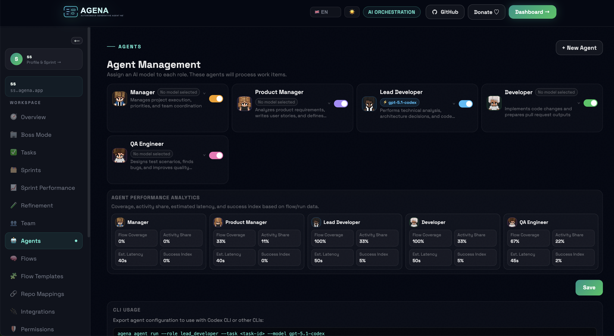

### Create Agent — Pick Character, Type & Model
Three-step wizard: pick a pixel character and name, choose provider (OpenAI, Gemini, Codex CLI, Claude CLI, Custom), then select a model.

| Step 1 — Character | Step 2 — Provider | Step 3 — Model |
|---|---|---|
| 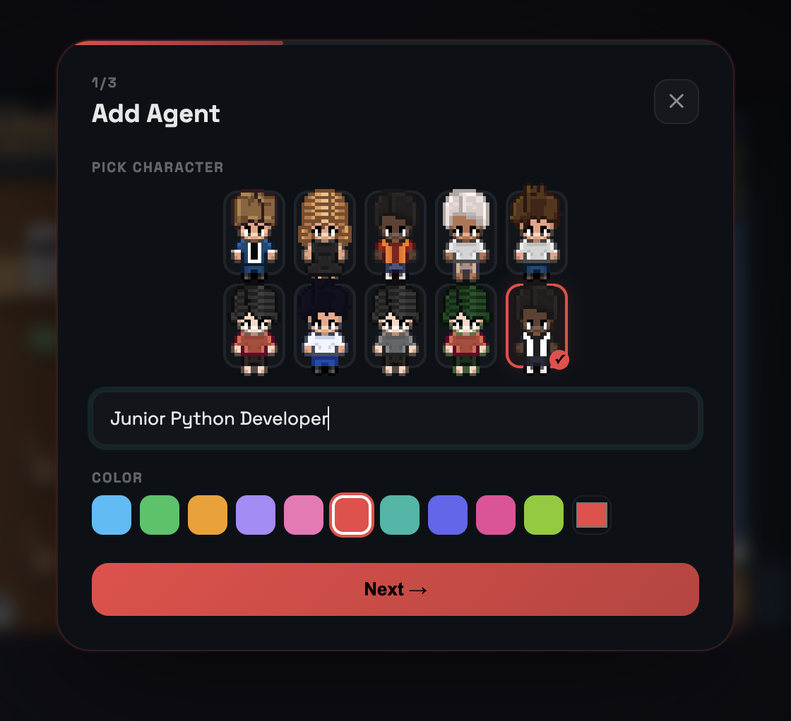 | 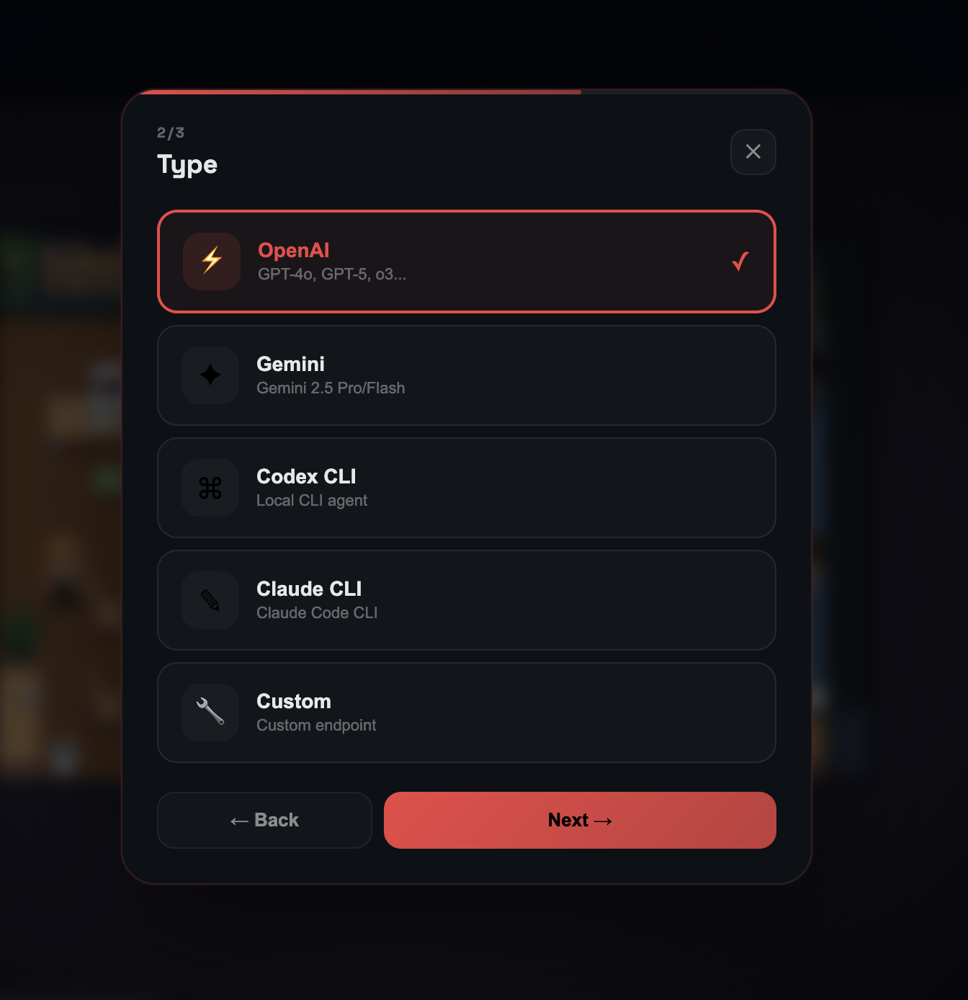 | 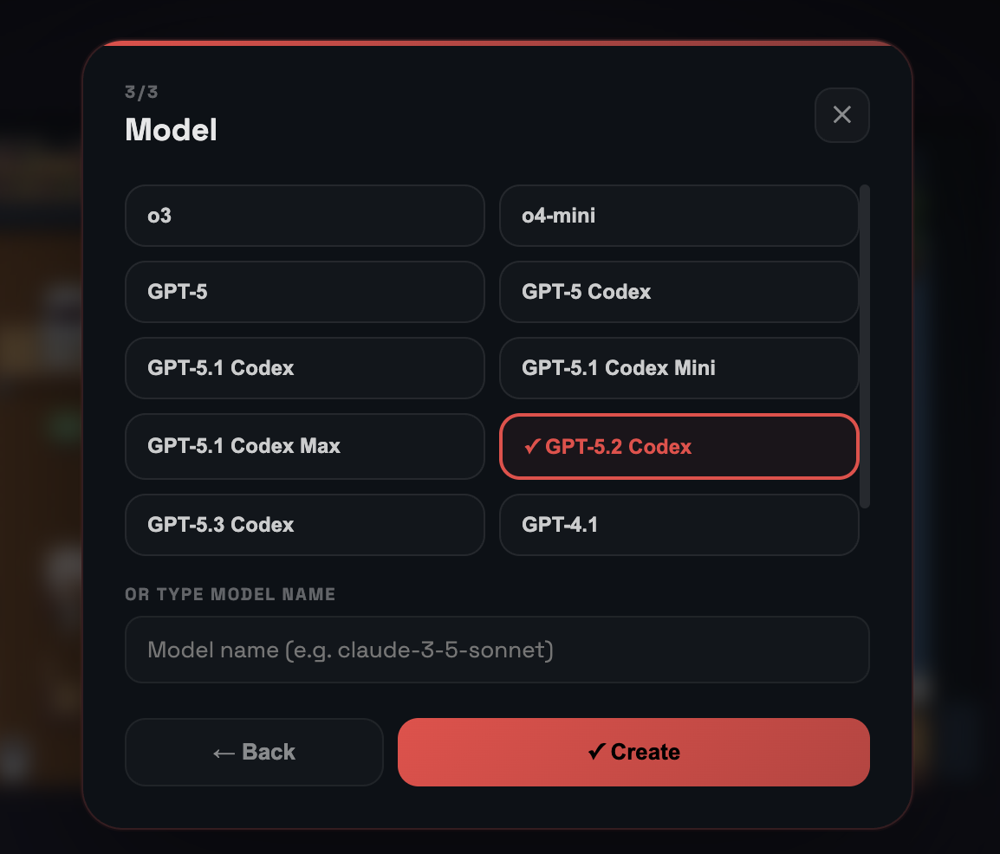 |

### Create Agent — Advanced (Agents Page)
Full agent creation form with character picker, label, color, provider, model name, system prompt, Create PR toggle, and enable/disable switch.

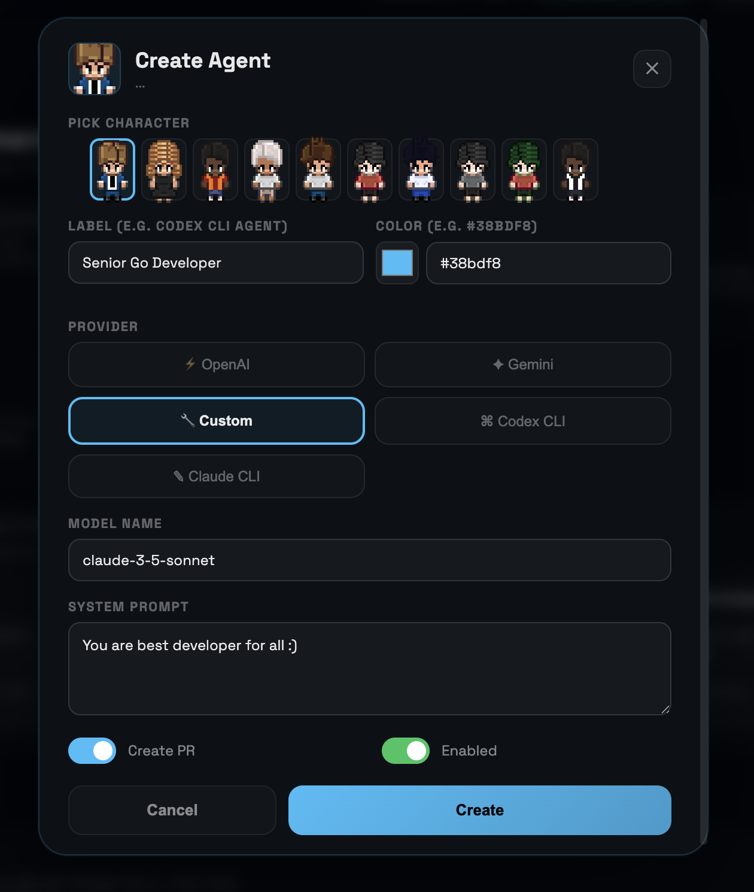

### Agent Detail — Assign & Run Tasks
Click any agent to see its config, assign sprint tasks or create new ones, and trigger runs directly.

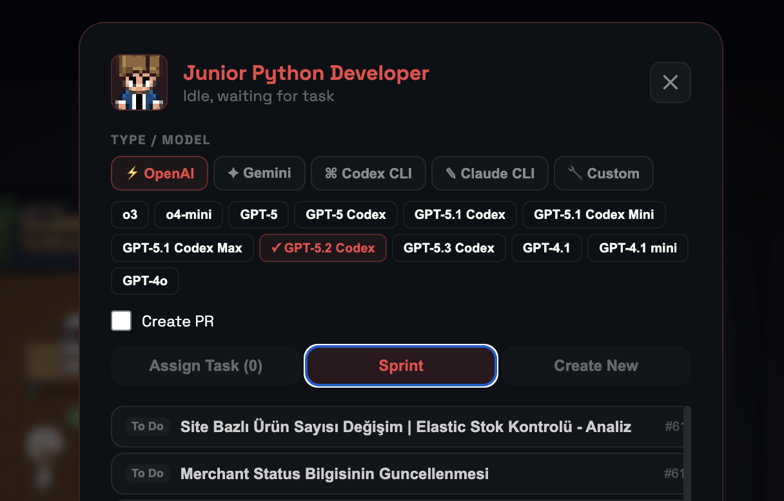

### AI Team Panel
The sidebar shows all AI team members with their pixel avatars. Click "+" to add a new agent to the team.

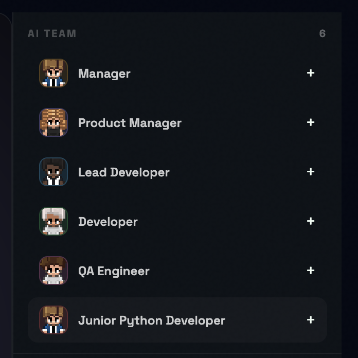

### Agent Flows — Visual Pipeline Builder
Drag-and-drop flow editor with nodes for PM Analysis, Technical Plan, Development, and QA Test. Includes approval gates, run history, version control, dry run, and flow templates.

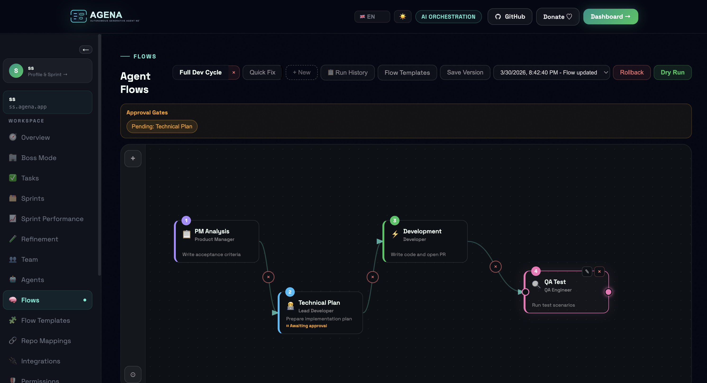

### Sprint Board
Kanban-style board with color-coded columns per state (Backlog, Blocked, Ready for Production, UAT, Code Review, Done). Import tasks directly from Azure DevOps or Jira sprints.

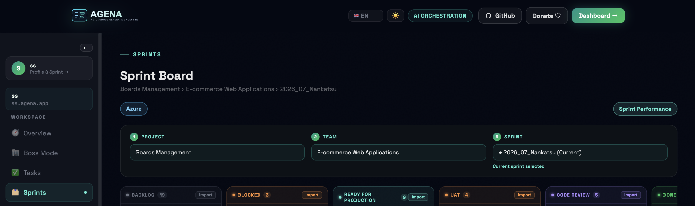

### Sprint Performance
Team health dashboard with circular gauge score, timeline progress, completion tracking, and per-member expandable cards showing individual task status (green/yellow/red).

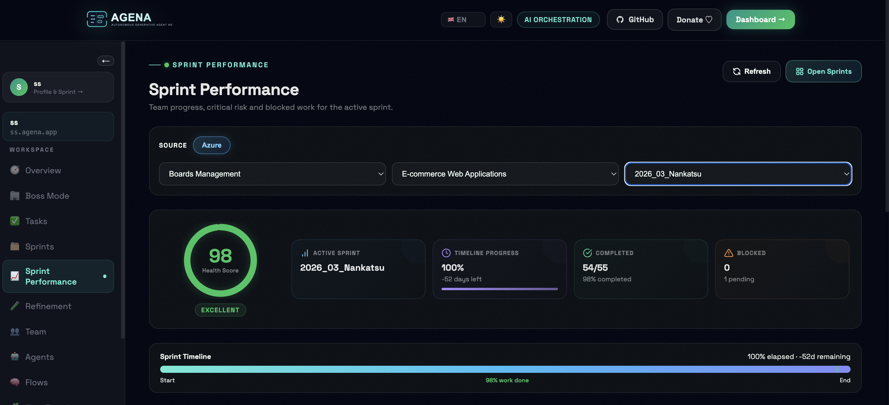

### Task Feed — Create & Manage
Create tasks with title, description, story context, acceptance criteria, edge cases, and cost guardrails. Filter by status (New, Queued, Running, Completed, Failed) and source (Azure, Jira).

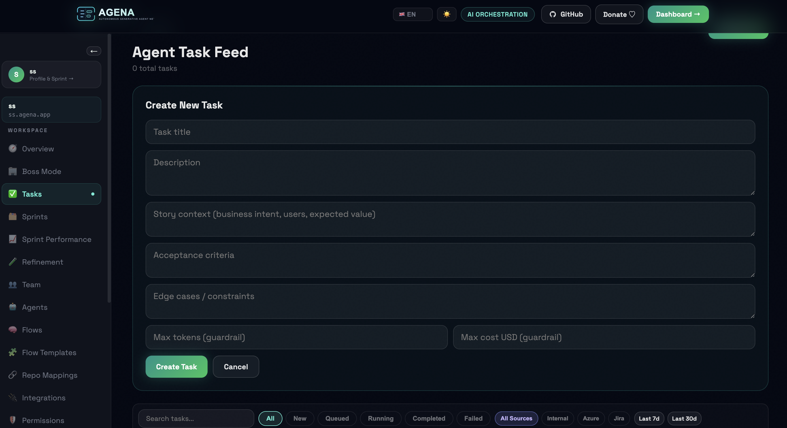

### Task Deletion Confirmation
Safe deletion modal with task title preview and confirmation step.

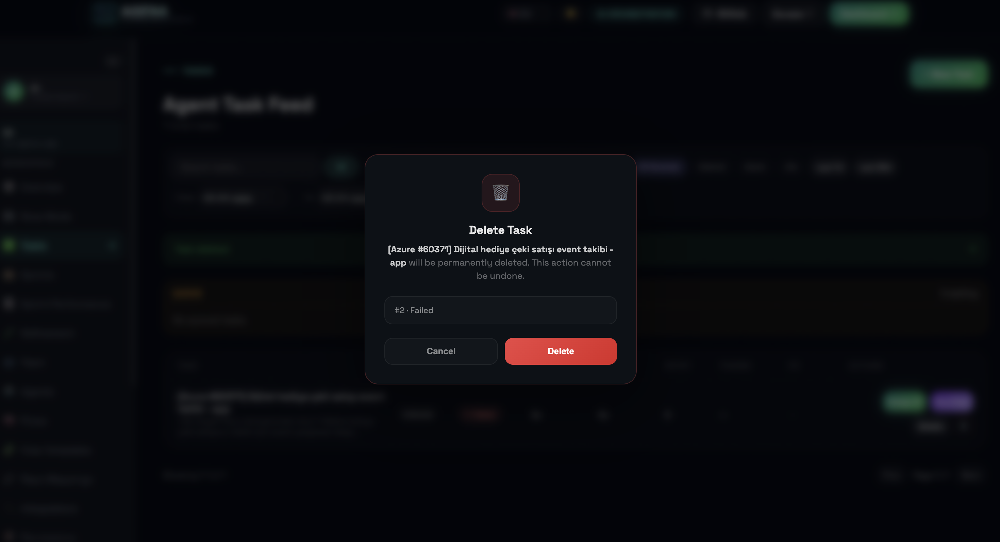

### Repo Mappings
Map Azure DevOps repositories to local paths for code generation. Scan repos and auto-generate agent configuration files.

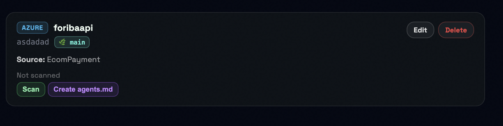

### Team Member Selection
Search and select team members from your Azure DevOps or Jira organization to track sprint performance.

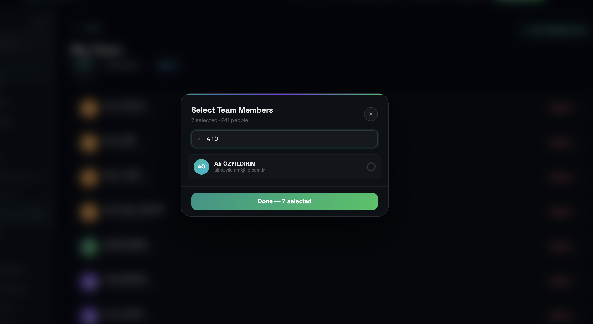

## Architecture

Task Fetch/Create -> Save TaskRecord -> Queue Redis -> Worker -> Agent Pipeline -> GitHub PR -> Save Result + Logs + Usage

## Project Layout

```text
ai-agent-system/
  api/
  agents/
  alembic/
  core/
  db/
  frontend/
  integrations/
  memory/
  models/
  schemas/
  security/
  services/
    llm/
  workers/
  docker/
  docker-compose.yml
  requirements.txt
  .env.example
```

## Environment Setup

```bash
cp .env.example .env
cp frontend/.env.example frontend/.env.local
```

Fill at least:
- `OPENAI_API_KEY`
- `JWT_SECRET_KEY`
- `GITHUB_TOKEN`, `GITHUB_OWNER`, `GITHUB_REPO`
- Stripe/Iyzico keys if payment integrations are enabled

Integration credentials are tenant-scoped from dashboard/API (`/integrations/*`).
`JIRA_*` and `AZURE_*` env vars are optional global fallbacks.

## Run with Docker

```bash
docker compose up --build
```

Backup (prod secrets + MySQL volume):

```bash
./scripts/backup-prod.sh
```

Services:
- Backend API: `http://localhost:8010`
- Frontend: `http://localhost:3010`
- MySQL: `localhost:3306`
- Redis: `localhost:6379`
- Qdrant (vector memory): `http://localhost:6333`

## Frontend Restart (Blue/Green)

Quick restart (no rebuild):

```bash
cd /var/www/tiqr
docker-compose restart frontend_green
docker-compose restart frontend_blue
systemctl reload nginx
```

Rebuild and deploy updated frontend:

```bash
cd /var/www/tiqr
docker-compose up -d --build frontend_green frontend_blue
systemctl reload nginx
```

## Local Development

Backend:

```bash
python3.11 -m venv .venv
source .venv/bin/activate
pip install -r requirements.txt
uvicorn api.main:app --reload --host 0.0.0.0 --port 8010
```

Worker:

```bash
python -m workers.redis_worker
```

Frontend:

```bash
cd frontend
npm install
npm run dev
```

## API Endpoints

Auth:
- `POST /auth/signup`
- `POST /auth/login`

Organization:
- `POST /org/invite`
- `POST /org/invite/accept`

Billing:
- `GET /billing/status`
- `POST /billing/plan`
- `POST /billing/stripe/checkout`
- `POST /billing/stripe/webhook`
- `POST /billing/iyzico/checkout`
- `POST /billing/iyzico/webhook`

Tasks:
- `POST /tasks`
- `GET /tasks`
- `GET /tasks/{id}`
- `POST /tasks/{id}/assign`
- `GET /tasks/{id}/logs`
- `POST /tasks/import/jira`
- `POST /tasks/import/azure`

Integrations (org scoped):
- `GET /integrations`
- `GET /integrations/{provider}`
- `PUT /integrations/jira`
- `PUT /integrations/azure`

Other:
- `POST /agents/run`
- `POST /github/pr`
- `GET /health`

## cURL Test Flow

1. Sign up:

```bash
curl -X POST http://localhost:8010/auth/signup \
  -H "Content-Type: application/json" \
  -d '{
    "email": "owner@example.com",
    "full_name": "Owner User",
    "password": "Secret123!",
    "organization_name": "Acme Engineering"
  }'
```

2. Use token:

```bash
export TOKEN="<ACCESS_TOKEN>"
```

3. Create task:

```bash
curl -X POST http://localhost:8010/tasks \
  -H "Authorization: Bearer $TOKEN" \
  -H "Content-Type: application/json" \
  -d '{"title":"Build invoice webhook","description":"Add idempotency and retries"}'
```

4. Assign task:

```bash
curl -X POST http://localhost:8010/tasks/1/assign \
  -H "Authorization: Bearer $TOKEN"
```

5. Poll:

```bash
curl -X GET http://localhost:8010/tasks/1 -H "Authorization: Bearer $TOKEN"
curl -X GET http://localhost:8010/tasks/1/logs -H "Authorization: Bearer $TOKEN"
```

## Plans

- Free: 5 tasks/month
- Pro: unlimited tasks

Execution is blocked when free quota is exhausted.

## Frontend Routes

- `/`
- `/pricing`
- `/signin`
- `/signup`
- `/tasks`
- `/tasks/[id]`

## End-to-End Test Scenario

1. Visit landing page
2. Sign up
3. Create task
4. Assign to AI
5. Watch status updates (5s polling)
6. Open generated PR
7. Upgrade plan

## Open Source

This repository is open-source under the MIT License.

- License: [LICENSE](./LICENSE)
- Contributing: [CONTRIBUTING.md](./CONTRIBUTING.md)
- Code of Conduct: [CODE_OF_CONDUCT.md](./CODE_OF_CONDUCT.md)
- Security: [SECURITY.md](./SECURITY.md)

## Donate / Sponsor

If AGENA helps your team, you can support development:

- GitHub Sponsors: https://github.com/sponsors/aozyildirim

After pushing this repo public, GitHub will also show a **Sponsor** button automatically because `.github/FUNDING.yml` is included.

---

## Support AGENA

Sponsor: https://github.com/sponsors/aozyildirim
